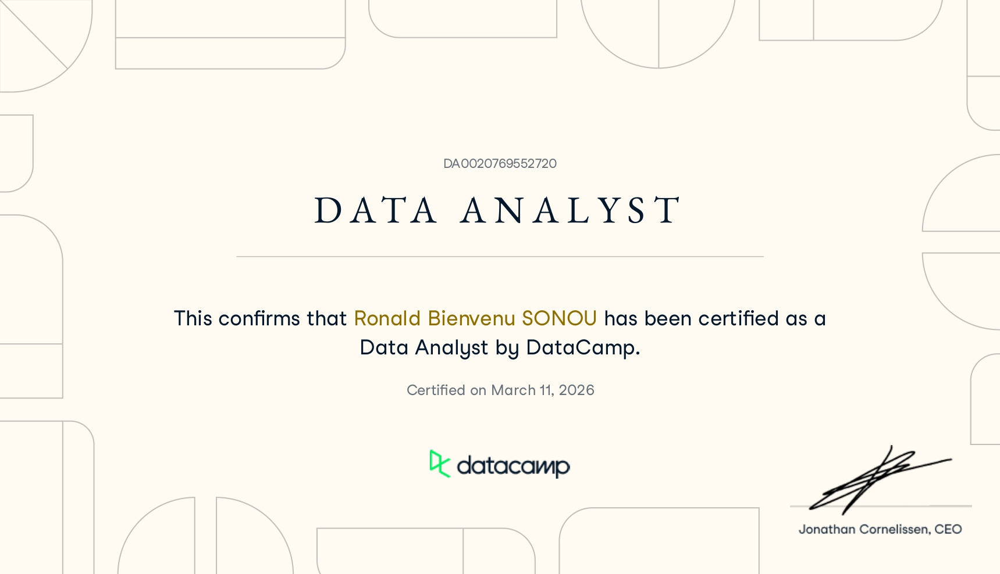
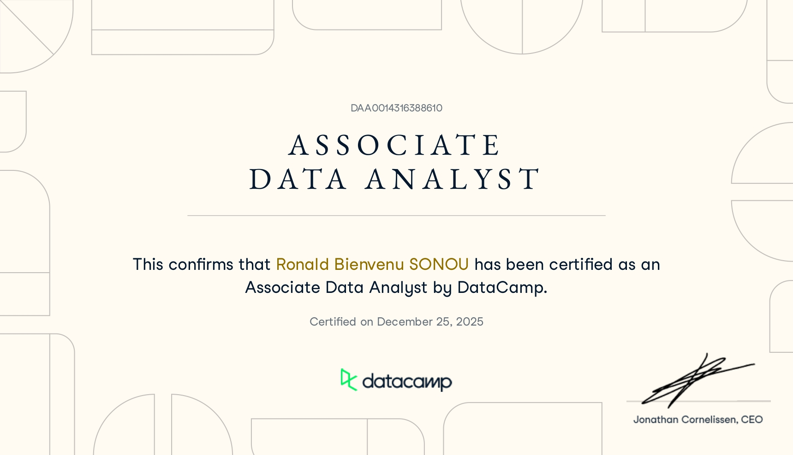
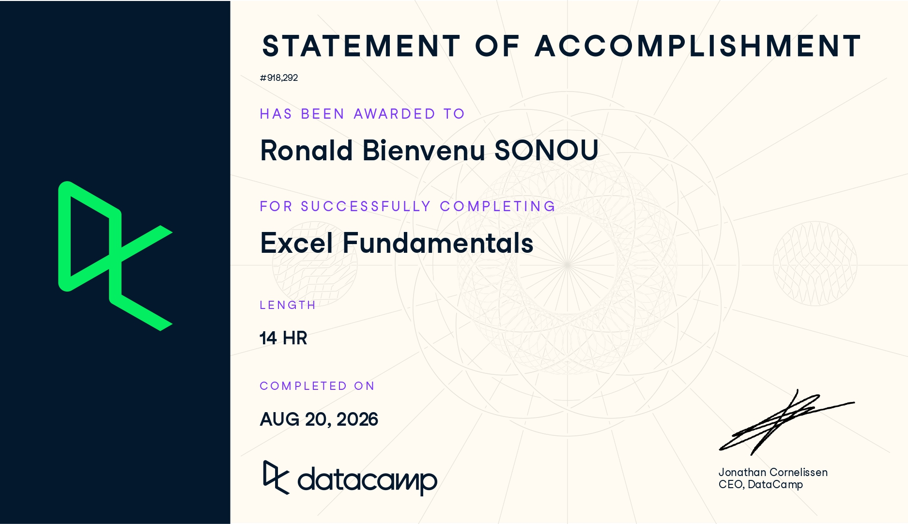
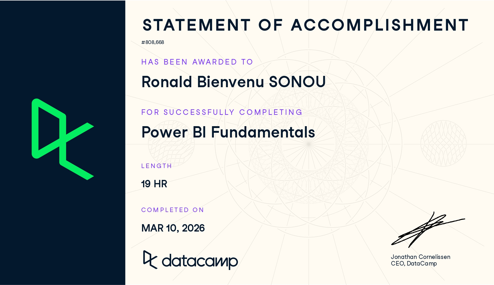
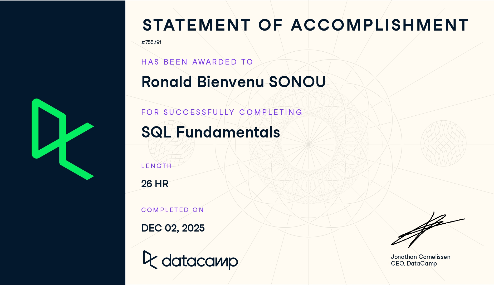

# 🏆 My Certifications

> A collection of my professional certifications, validated by DataCamp.

---

## 📊 Data Analyst Certification

| **Certification** | **Issuer** |**Credential ID** |**Certified on** | **Verification** |
|-------------------|------------|------------------|-----------------|-----------------|
| Data Analyst |  DataCamp |`DA0020769552720` |  March 11, 2026 | [🔗 Verify this certificate](https://www.datacamp.com/certificate/DA0020769552720) |

**About this certification:**
The Data Analyst in Python certification validates skills in:
- **Introduction to Python**: Python basics, variables, data types, functions
- **Intermediate Python**: Loops, conditionals, dictionaries, pandas basics
- **Data Manipulation with pandas**: DataFrames, filtering, grouping, merging
- **Joining Data with pandas**: INNER, LEFT, RIGHT, FULL joins with pandas
- **Introduction to Statistics in Python**: Descriptive statistics, distributions
- **Introduction to Data Visualization with Seaborn**: Charts, plots, customization
- **Exploratory Data Analysis in Python**: Data profiling, patterns, trends
- **Sampling in Python**: Random sampling, sampling distributions, CLT
- **Hypothesis Testing in Python**: T-tests, p-values, statistical significance

---

## 📈 Associate Data Analyst Certification

| **Certification** | **Issuer** | **Credential ID** | **Certified on** | **Verification** |
|-------------------|------------|-------------------|------------------|------------------|
| Associate Data Analyst | DataCamp | `DAA0014316388610` | December 25, 2025 | [🔗 Verify this certificate](https://www.datacamp.com/certificate/DAA0014316388610) |

**About this certification:**
The SQL Fundamentals certification validates skills in:
- **Introduction to SQL**: SQL basics, SELECT, filtering, sorting
- **Intermediate SQL**: Aggregations, CASE, subqueries
- **Joining Data in SQL**: INNER, LEFT, RIGHT, FULL JOINs
- **Data Manipulation in SQL**: INSERT, UPDATE, DELETE
- **PostgreSQL Summary Stats and Window Functions**: Aggregations, ROW_NUMBER, RANK, LAG
- **Functions for Manipulating Data in PostgreSQL**: String, date, and numeric functions
- **Analyzing Students' Mental Health**: Bonus real-world project with SQL

---

## 📉 Excel Fundamentals Certification

| **Certification** | **Issuer** | **Credential ID** | **Certified on** | **Verification** |
|-------------------|------------|-------------------|------------------|------------------|
| Power BI Fundamentals | DataCamp | `#808,668` | March 10, 2026 | [🔗 Verify this certificate](https://www.datacamp.com/certificate/808668) |

**About this certification:**
The Excel Fundamentals certification validates skills in:
- **Introduction to Excel**: Spreadsheet basics, cells, ranges, formulas
- **Data Preparation in Excel**: Cleaning, formatting, and organizing data
- **Data Visualization in Excel**: Charts, graphs, and conditional formatting
- **Data Analysis in Excel**: PivotTables, functions, and advanced analysis
- **Case Study: Analyzing Customer Churn in Excel**: Real-world churn analysis project

---

## 📊 Power BI Fundamentals Certification

| **Certification** | **Issuer** | **Credential ID** | **Certified on** | **Verification** |
|-------------------|------------|-------------------|------------------|------------------|
| Power BI Fundamentals | DataCamp | `#808,668` | March 10, 2026 | [🔗 Verify this certificate](https://www.datacamp.com/certificate/808668) |

**About this certification:**
The Power BI Fundamentals certification validates skills in:
- **Introduction to DAX**: Measures, calculated columns, time intelligence
- **Data Visualization**: Charts, dashboards, storytelling
- **Customer Churn Case Study**: Real-world analysis with Power BI
- **Data Preparation**: Power Query, ETL, data cleaning
- **Data Modeling**: Star schema, relationships, optimization

---

## 🗄️ SQL Fundamentals Certification

| **Certification** | **Issuer** | **Credential ID** | **Certified on** | **Verification** |
|-------------------|------------|-------------------|------------------|------------------|
| SQL Fundamentals | DataCamp | `#755,191` | December 02, 2025 | [🔗 Verify this certificate](https://www.datacamp.com/certificate/755191) |

**About this certification:**
The SQL Fundamentals certification validates skills in:
- **Database Design**: Schema design, normalization, ERD
- **Functions in PostgreSQL**: String, date, and numeric functions
- **Summary Stats & Window Functions**: Aggregations, ROW_NUMBER, RANK, LAG
- **Data Manipulation in SQL**: INSERT, UPDATE, DELETE, CASE
- **Joining Data in SQL**: INNER, LEFT, RIGHT, FULL JOINs
- **Students' Mental Health Project**: Real-world data analysis with SQL

---

## 📋 Summary Table

| Certification | Issuer | Date | Credential ID | Verify |
|---------------|--------|------|---------------|--------|
| **Data Analyst** | DataCamp | March 2026 | `DA0020769552720` | [🔗 Verify](https://www.datacamp.com/certificate/DA0020769552720) |
| **Associate Data Analyst** | DataCamp | December 2025 | `DAA0014316388610` | [🔗 Verify](https://www.datacamp.com/certificate/DAA0014316388610) |
| **Power BI Fundamentals** | DataCamp | March 2026 | `#808,668` | [🔗 Verify](https://www.datacamp.com/certificate/808668) |
| **SQL Fundamentals** | DataCamp | December 2025 | `#755,191` | [🔗 Verify](https://www.datacamp.com/certificate/755191) |
| **Excel Fundamentals** | DataCamp | August 2026 | `#918,292` | [🔗 Verify](https://www.datacamp.com/certificate/918292) |

---

## 📬 Connect With Me

