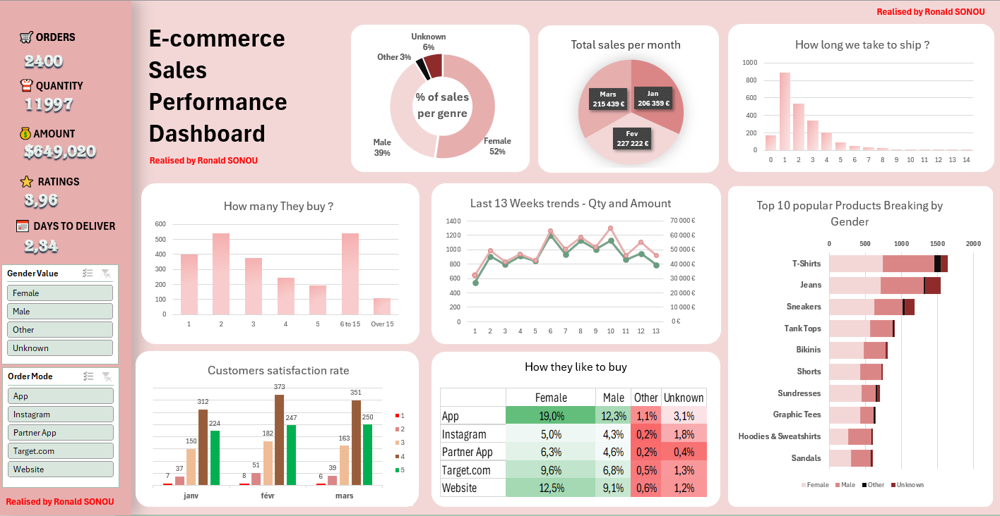

# 🛍️ E-Commerce Sales Performance Dashboard — Excel

> **Complete sales analysis of a fashion e-commerce store
> over 3 months (January–March 2026)**

---

## 📌 Project Context

This project consists of building a complete commercial performance dashboard in **Microsoft Excel**, based on raw sales data from a fashion e-commerce store specializing in ready-to-wear (T-Shirts, Jeans, Sneakers, Bikinis, etc.).

The goal is to transform raw transactional data into a **visual, interactive, and immediately actionable** decision-making tool for a manager or commercial director.

The dashboard covers 3 months of activity (January–March 2026) and is built on over **2,400 transactions** across the United States.

---

## 📊 Global KPIs

| Indicator | Value |
|-----------|-------|
| 🛒 Orders | 2,400 |
| 📦 Quantity Sold | 11,997 items |
| 💰 Revenue | $649,019.80 |
| ⭐ Satisfaction Score | 3.96 / 5 |
| 🚚 Average Delivery Time | 2.34 days |

---

## 🔍 Analyses Performed

### 1. Gender Segmentation
- **Female**: 52%
- **Male**: 39%
- **Other**: 3%
- **Unknown**: 6%

💡 **Female customers are the primary driver of sales.**

### 2. Monthly Revenue Evolution

| Month | Revenue |
|-------|---------|
| January | $206,359 |
| February | $227,222 |
| March | $215,439 |

📈 **Overall growth of +4.4% between January and March.**

### 3. Purchase Channel — Key Insights

| Channel | Female | Male | Other | Unknown |
|---------|--------|------|-------|---------|
| App | **19.0%** | 12.3% | 1.1% | 3.1% |
| Website | 12.5% | 9.1% | 0.6% | 1.2% |
| Target.com | 9.6% | 6.8% | 0.5% | 1.3% |
| Partner App | 6.3% | 4.6% | 0.2% | 0.4% |
| Instagram | 5.0% | 4.3% | 0.2% | 1.8% |

💡 **The mobile App is the dominant channel across all audiences. Instagram underperforms despite its potential.**

### 4. Top 10 Products (by Quantity Sold)

1. T-Shirts *(leader across all categories)*
2. Jeans
3. Sneakers
4. Tank Tops
5. Bikinis
6. Shorts
7. Sundresses
8. Graphic Tees
9. Hoodies & Sweatshirts
10. Sandals

### 5. Geographic Breakdown (United States)

Analysis by State and County — **California** concentrates the majority of sales:

| State | County | Quantity | Amount |
|-------|--------|----------|--------|
| California | Los Angeles County | 3,991 | $215,551.52 |
| California | Alameda County | 579 | $31,885.00 |
| California | Contra Costa County | 341 | $16,168.47 |
| California | Fresno County | 279 | $12,662.55 |
| California | Kern County | 222 | $11,354.20 |

### 6. Customer Satisfaction (Scores 1 to 5)

Monthly evolution across January, February, and March — a globally positive trend with growth in the score of 5 in March (351 reviews vs 312 in January).

### 7. Delivery Time

Distribution concentrated on **0 to 2 days** — a very satisfactory logistics performance indicator (average: **2.34 days**).

### 8. 13-Week Trend

Dual-axis analysis **Quantity / Amount** over 13 consecutive weeks to detect sales cycles and anticipate activity peaks.

---

## 💡 Key Insights & Recommendations
1- **CHANNEL**: Invest more in the mobile app. The App generates the highest conversion rate (19% female, 12.3% male). Instagram is underutilized.

2- **GENDER**: The female customer base (52%) should guide product and marketing decisions as a priority.

3- **GEOGRAPHY**: California concentrates the majority of sales. Opportunity for expansion into other states.

4- **PRODUCTS**: T-Shirts and Jeans = core of the offering. Optimize stock and promotions on these two categories first.

5- **LOGISTICS**: 2.34 days average delivery time. Maintain this performance as a competitive advantage.

---

## 🛠️ Tools & Techniques

| Tool | Usage |
|------|-------|
| Microsoft Excel | Main tool |
| PivotTables | Aggregation and segmentation |
| Dynamic Charts | Visualization (bar, line, pie, donut) |
| Interactive Slicers | Gender and Purchase Channel filters |
| Conditional Formatting | Heatmap for the "How they like to buy" table |
| Advanced Formulas | KPIs, percentage calculations, aggregations |

---

## 👤 Author

**SONOU Finangnon Ronald Bienvenu**
Data Analyst | DataCamp Certified — DA0020769552720

