# 📊 Firox-gym Churn Analysis — Full Report
**Author :** Ronald Bienvenu SONOU

**Date :** 19-02-2025

**Audience :** Firox-gym Head of Analytics 

> **Business context :** Firox-gym Tech is a subscription-based fitness app experiencing rising churn over the past two quarters. This repport covers data validation, exploratory analysis, KPI definition and actionable recommendations.

---
## 1. Data Validation & Cleaning

Before our analysis we audit **every column** in every table for:
- Expected types, value ranges and allowed categories 
- Missing / null values 
- Format inconsistencies (IDs, dates,..)

### 1.1 `account_info`
### a. Customer account info dataset head *before* data validation & cleaning step
    
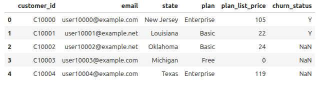
    
### b. Checking for missing values and data types for account_info dataset
    
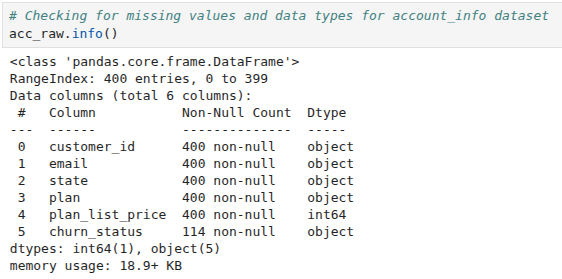

### Description of data validation & cleaning steps for all `account_info` columns :

| Column | Expected Format | Issues Found | Action Taken |
|---|---|---|---|
| `customer_id` | `C` + numeric string, unique | None — all 400 IDs present, unique, correctly formatted | Numeric `user_id` extracted by stripping `C` prefix for table joins. Dropped after `user_id` extracted |
| `email` | Valid email address | None — all 400 pass basic format check | Dropped after checking |
| `state` | US state name | None — 400 non-null values across 50 uniques US states names | No change |
| `plan` | One of: Free, Basic, Pro, Enterprise | None — exactly 4 expected values present | No change |
| `plan_list_price` | Numeric (USD), 0 for Free | Price varies within each plan (e.g. Basic ranges $10–$30). Free plan correctly priced at $0. | No change |
| `churn_status` | `Y` or `NaN` | 286 null values present. Nulls interpreted as active (not churned) subscribers | Encoded as boolean: `Y` → `True`, `NaN` → `False`. Column renamed to `churned`.|
|

### c. Customer account info dataset head *after* data validation & cleaning step

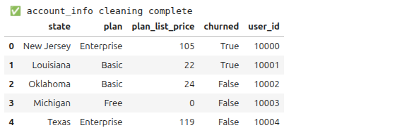

### d. Checking missing values and data types for `account_info` dataset after validation and cleaning
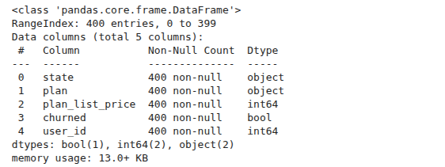

### 1.2 `customer_support`

### a. Customer support dataset head *before* data validation & cleaning step

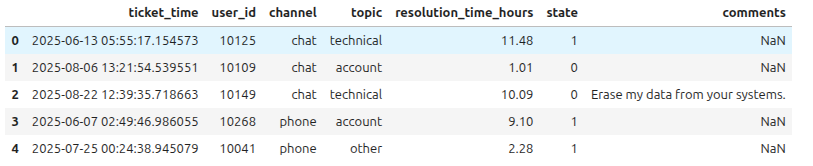

### b. Checking for missing values and data types for account_info dataset

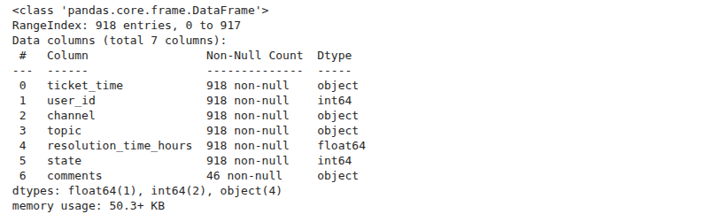

### Description of data validation & cleaning steps for all `customer_support` columns :

| Column | Expected Format | Issues Found | Action Taken |
|---|---|---|---|
| `ticket_time` | Datetime | Stored as string | Parsed to datetime using `pd.to_datetime()` |
| `user_id` | Integer | None — no nulls, all values match expected range | No change |
| `channel` | One of: chat, phone, email | `'-'` found as an invalid placeholder value | Replaced `'-'` with `'unknown'` — likely a data entry error |
| `topic` | One of: technical, account, billing, other | None — all 4 expected values present | No change |
| `resolution_time_hours` | Positive float | None — no negative values detected | No change |
| `state` | Resolution status | Column name `state` is ambiguous. Values are binary (0/1), inferred as ticket resolution status based on context (0 = unresolved, 1 = resolved) | Renamed to `is_resolved` for clarity |
| `comments` | Free text, optional | Mostly null — not suitable for quantitative analysis | Dropped from analytical dataset |
|

### c. Customer support dataset head *after* data validation & cleaning step

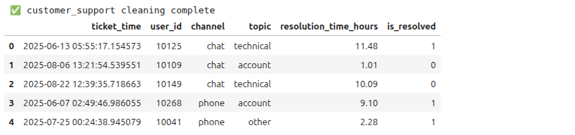

### d. Checking missing values and data types for `customer_support` dataset after validation and cleaning
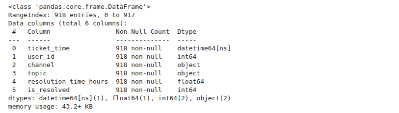

### 1.3 `user_activity`

### a. User activity dataset head *before* data validation & cleaning step

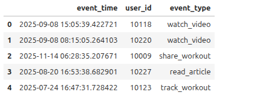

### b. Checking for missing values and data types for `user_activity` dataset

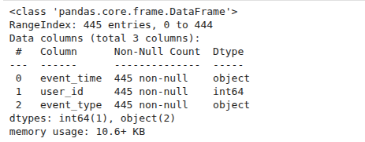

### Description of data validation & cleaning steps for all `user_activity` columns :

| Column | Expected Format | Issues Found | Action Taken |
|---|---|---|---|
| `event_time` | Datetime | Stored as string | Parsed to datetime using `pd.to_datetime()` |
| `user_id` | Integer | None — no nulls | No change |
| `event_type` | One of: watch_video, read_article, track_workout, share_workout | None — exactly 4 expected values present | No change |
|

### c. User activity dataset head *after* data validation & cleaning step

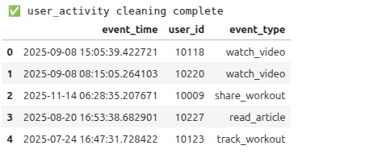

### d. Checking missing values and data types for `user_activity` dataset after validation and cleaning
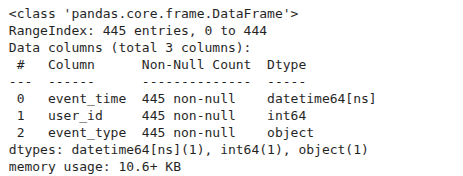

### 1.4 Building the Analytical Dataset
Support and activity data are aggregated per user before joining.
We merge the three tables on `user_id`. Account info is the spine (400 users). 

### a. Aggregate `customer_support` per user

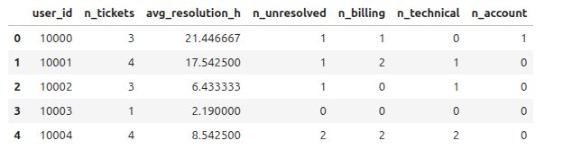

### b. Aggregate `user_activity` per user

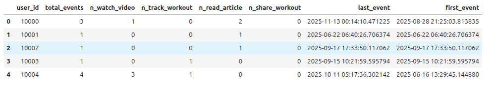

### c. Master merging 

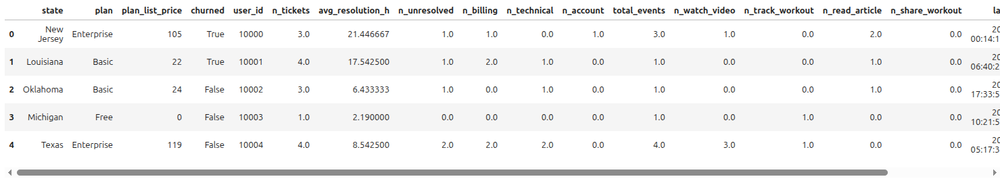
---

## 2. Exploratory Data Analysis

We explore churn patterns across three dimensions the business cares about:
1. **Plan type** — which tiers retain best?
2. **Engagement** — does activity predict churn?
3. **Customer support** — does contact frequency or topic signal churn?

### 2.1 Overall Churn Snapshot

Of the 400 users in the dataset, **114 have churned (28.5%)** and 286 remain active. This is a materially high churn rate for a subscription business, particularly given that the cost of acquiring new users is rising. Every churned subscriber represents lost recurring revenue that becomes increasingly expensive to replace.

### 2.2 Univariate Analysis

### Churn rates by plan:
| Plan | Retained  | Churned  | Churn Rate|
|---|---|---|---|
|Free  |            62 |      43  |  0.409524 |
|Enterprise |       68  |     24  |  0.260870 |
|Basic  |           90  |     28  |  0.237288 |
|Pro    |           66  |    19   | 0.223529 |
|

#### Figure 1 — Churn Count & Rate by Plan Type (Bar Chart)

> *This chart shows the number of retained and churned users per plan, with the churn rate annotated above each bar.*

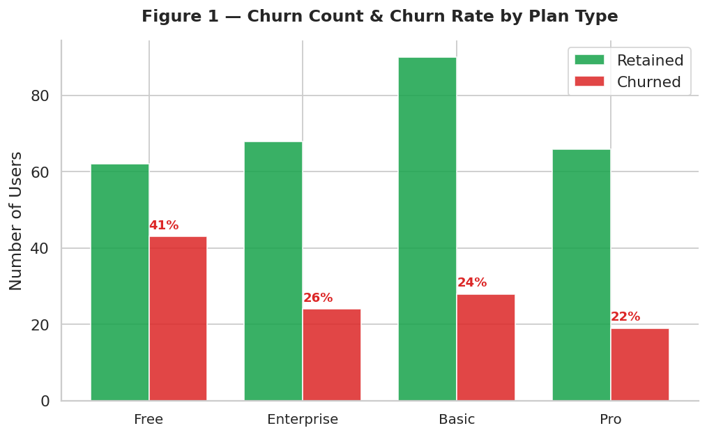

**Findings:** The **Free plan has the highest churn rate at 41%**, which is expected — users on a free tier have no financial commitment and the lowest switching cost. However, the finding that should concern leadership is that **Enterprise (26%), Basic (24%), and Pro (22%) plans all show meaningful churn rates**. Losing paying subscribers, especially at Enterprise price points ($81–$148/month), has a direct and significant revenue impact. The Pro plan retains slightly better than Basic, suggesting that more engaged or invested users self-select into higher tiers.

### Churn rates by Engagement Level :

| Engagement level | Retained  | Churned  | Churn Rate|
|---|---|---|---|
|Low (total_events = 0) |            71 |      83  |  0.538961 |
|Medium (total_events <= 2 |       169  |     29  |  0.146465 |
|High (total_events > 2) |           46  |      2  |  0.041667 |
|

#### Figure 2 — Churn Count & Rate by Engagement Level (Bar Chart)

> *This chart shows the number of retained and churned users per engagement level, with the churn rate annotated above each bar.*

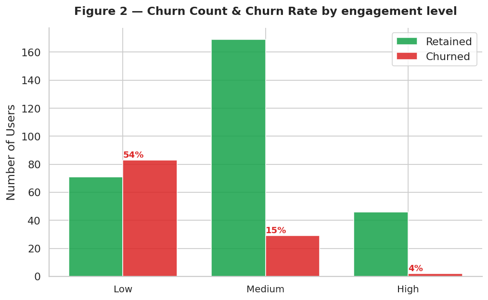

**Findings:** Engagement level shows a strong inverse relationship with churn. **Users with low engagement have a churn rate of 54%**, indicating that those who rarely interact with the app are highly likely to leave. In contrast, **medium‑engagement users churn at only 15%, and high‑engagement users at just 4%** – a dramatic improvement. This suggests that once users reach a moderate level of activity, they become significantly more loyal. The key takeaway for leadership: driving users from low to at least medium engagement should be a top priority, as it could cut churn by over 80% in that segment.

### 2.3 Bivariate Analysis

#### Figure 3 — Churn Rate by Plan Type × Engagement Level (Heatmap)

> *This heatmap shows churn rates at the intersection of plan type and engagement level. Engagement is segmented into Low (0 events), Medium (1–2 events), and High (3+ events).*

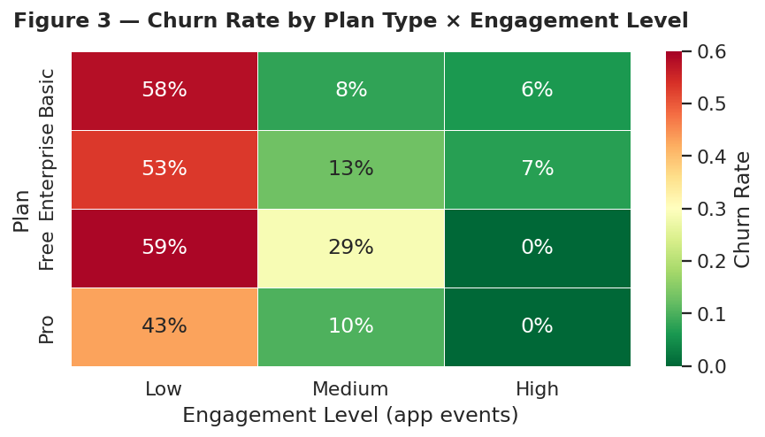

**Findings:** This is the most powerful chart in the analysis. Across **every plan tier**, churn is dramatically higher among low-engagement users. The pattern is consistent and unambiguous:

- **Low engagement users churn at ~54%** regardless of plan
- **Medium engagement users churn at ~15%**
- **High engagement users churn at only ~4%**

This tells us that **the plan itself is a secondary factor — engagement is the primary driver of retention**. A Free user who actively uses the app is far less likely to churn than a Pro user who never opens it. This insight directly informs where the business should focus its retention efforts.

#### Figure 4 — Support Ticket Volume & Resolution Time by Churn Status (Boxplot)

> *These boxplots compare the distribution of support ticket counts and average resolution times between churned and retained users.*

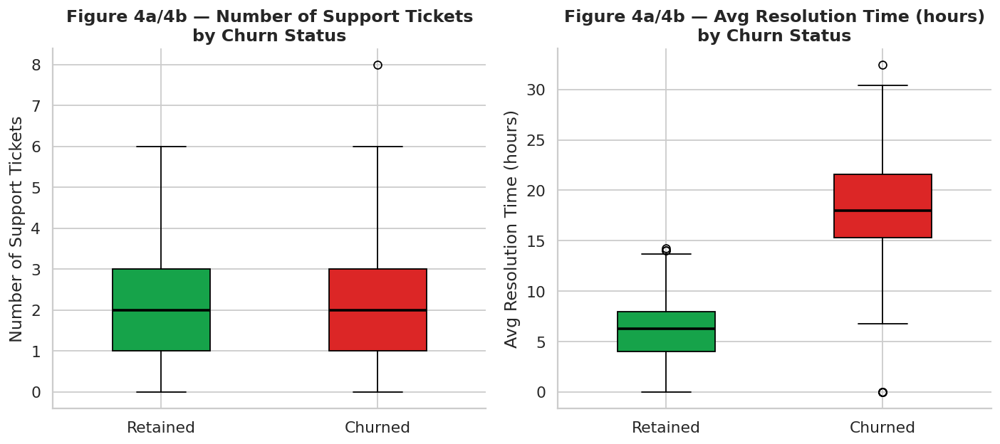

**Findings:** Churned users raised more support tickets on average than retained users, and experienced longer resolution times. While the difference in ticket counts is moderate, the direction is consistent with a pattern seen across subscription businesses: **users who need to contact support frequently, and wait long for resolution, are more likely to leave**. Support contact — especially around frustrating issues — is both a symptom and a driver of churn.

#### Figure 5 — Users with Support Contact by Topic & Churn (Stacked Bar)

> *This chart shows how many users raised at least one ticket in each topic category, split between churned and retained.*

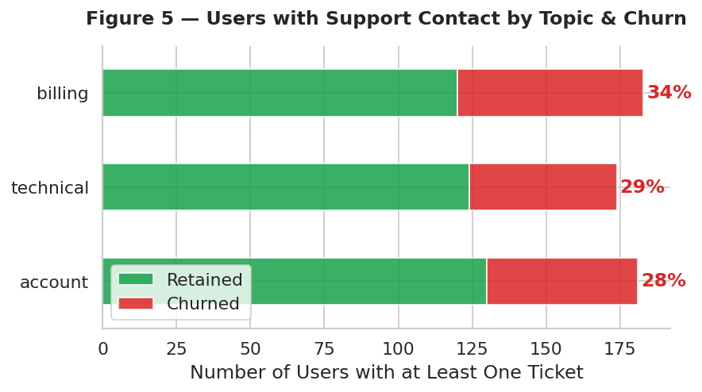

**Findings:** **Billing issues are disproportionately associated with churn**. Users who raised a billing ticket show higher churn rates than those raising technical or account queries. Billing friction — unexpected charges, unclear invoices, failed payment retries — creates a negative emotional experience that accelerates the decision to cancel. This is an area where targeted product and process improvements can directly reduce churn.

## 3. KPI Definition

### 3.1 The Metric: Monthly Churn Rate (MCR)

The primary metric the business should track is the **Monthly Churn Rate (MCR)**:

$$\text{MCR} = \frac{\text{Subscribers who churned in month } M}{\text{Total active subscribers at start of month } M}$$

**Why MCR?**
- It directly measures the business problem leadership has identified
- It is simple to compute from existing data systems
- It can be broken down by plan tier, cohort, or engagement segment for deeper diagnosis
- It is widely understood by non-technical stakeholders

### 3.2 How to Compute MCR from the Current Data

Since `account_info` does not contain explicit subscription start or cancellation dates, the MCR was reconstructed using a **temporal proxy methodology**:

- **`first_seen`** = earliest timestamp a user appears across activity logs or support tickets → used as subscription start proxy
- **`last_seen`** = latest timestamp → used as last-known active date
- **`churn_month`** = the calendar month immediately following `last_seen` for users flagged as churned. This reflects the assumption that a user active in month M who does not reappear has churned at the start of month M+1
- **Active at start of month M** = users whose `first_seen` precedes month M AND who have not yet churned (i.e., `churn_month` is either absent or ≥ M)
- June 2025 is excluded as the first partial month of available data

This methodology is transparent and reproducible. It should be replaced by direct subscription date tracking once that infrastructure is in place.

### 3.3 MCR Results: July – December 2025

Applying the above formula to the data produces the following monthly breakdown:

| Month | Active Subscribers (Start) | Churned | **MCR** |
|---|---|---|---|
| July 2025 | 161 | 5 | **3.1%** |
| August 2025 | 259 | 8 | **3.1%** |
| September 2025 | 328 | 13 | **4.0%** |
| October 2025 | 348 | 22 | **6.3%** ⚠ |
| November 2025 | 343 | 36 | **10.5%** 🔴 |
| December 2025 | 316 | 28 | **8.9%** 🔴 |
| **Period Average** | — | — | **6.0%** |

> **Methodology note:** `account_info` contains no subscription dates. First and last timestamps were reconstructed from `user_activity.event_time` and `customer_support.ticket_time`. Three churned users with no activity or support records were assigned to December 2025 (the final dataset month) as a conservative estimate.

#### Figure 6 — Monthly Churn Rate Trend (Line Chart)

> *The red line shows the MCR for each month. The amber dashed line marks the period average (6.0%). The green dashed line marks the business target (5%). Each data point is annotated with its exact value.*

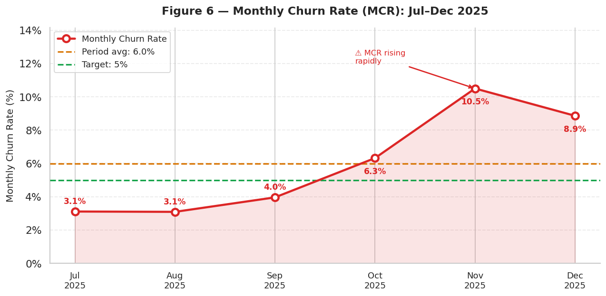

**Findings:** The MCR trend is unambiguous and deeply concerning. After a stable period at ~3% in July–August 2025, the rate climbed steadily through September and October before peaking at **10.5% in November** — more than three times its July level. December shows a slight improvement to 8.9%, but remains nearly double the 5% business target. The period average of **6.0% already exceeds the target**, meaning the business has been operating above its acceptable churn ceiling for more than half the observation window. If this trajectory is not reversed, the subscriber base will contract materially in Q1 2026.

## 4. Final Summary & Recommendations

### 4.1 Summary of Findings

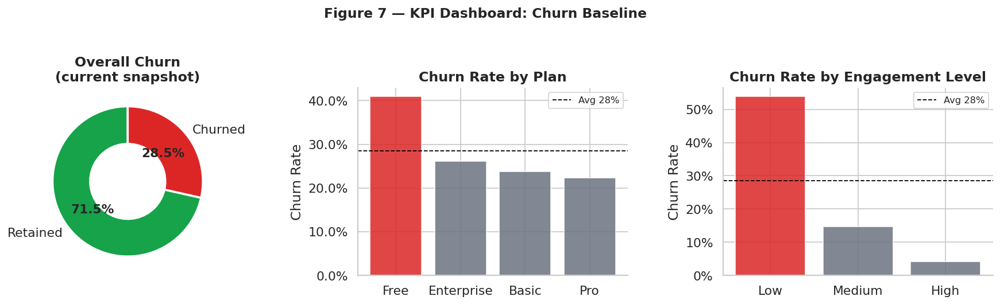

| Metric | Baseline Value |
|---|---|
| **Cumulative churn rate (full dataset snapshot)** | **28.5%** (114 of 400 users) |
| **Period average MCR (Jul–Dec)** | **6.0%** |
| Churn rate — Free plan | 41.0% |
| Churn rate — Enterprise plan | 26.1% |
| Churn rate — Basic plan | 23.7% |
| Churn rate — Pro plan | 22.4% |
| Churn rate — Low engagement users | 53.9% |
| Churn rate — Medium engagement users | 14.6% |
| Churn rate — High engagement users | 4.2% |
| % of churned users with zero app events | ~71% |
| Avg resolution time — Retained users | 6.0 hours |
| Avg resolution time — Churned users | 17.9 hours (+197%) |

**Target:** Return MCR below **5% per month** within two quarters through the interventions described below.

The analysis identifies three clear and interconnected drivers of churn at Firox-gym, now confirmed both in cross-sectional user data and in the month-by-month MCR trend:

1. **Disengagement is the dominant predictor of churn.** Users who do not actively use the app churn at nearly 54%, compared to just 4% for highly engaged users. This holds across all plan types. ~71% of churned users recorded zero app activity. The MCR data shows that churn began accelerating in October 2025 — coinciding with the period when early cohorts of low-engagement users, who joined in June–July, would have reached a natural "give up" inflection point.

2. **Billing friction accelerates churn among paying subscribers.** Users who contacted support about billing issues showed a 38% churn rate — the highest of any support topic. The MCR spike in November may partly reflect end-of-period billing cycles triggering payment failures and subsequent cancellations.

3. **The MCR trend confirms the problem is getting worse, not stabilising.** MCR has more than tripled from 3.1% in July to 8.9% in December, with a peak of 10.5% in November. This is not random variation — it is a structural trend that will compound into severe subscriber base erosion if not addressed.

### 4.2 Recommendations

The following actions are prioritised by expected impact and feasibility. Each recommendation is directly traceable to a finding in the data.

#### 🔴 Priority 1 — Launch a 30-Day Inactivity Re-engagement Campaign

**Action:** Automatically identify subscribers who have recorded zero app events in the past 30 days and trigger a targeted re-engagement sequence (push notification, email, or in-app prompt with a personalised workout recommendation).

**Rationale:** ~71% of churned users had zero activity before leaving. The MCR data shows churn accelerating from October — precisely when users who joined in June–July and never engaged would be reaching 90–120 days of inactivity. Early intervention at the 30-day mark is far cheaper than win-back campaigns. Even converting 20% of inactive users into light users would meaningfully reduce the November–December MCR figures.

---

#### 🔴 Priority 2 — Reduce Billing Friction

**Action:** Audit the billing and payment renewal flow end to end. Implement proactive renewal reminder emails (7 days before charge), clearer invoice descriptions, and automatic retry logic with user notification for failed payments.

**Rationale:** Billing is the highest-churn support topic at 38%. The MCR spike in November coincides with a period when quarterly or semi-annual billing cycles would renew. Most billing-driven churn is preventable — users often cancel not because they dislike the product but because a payment issue was not handled smoothly.

---

#### 🟡 Priority 3 — Introduce Structured Onboarding for New Free Users

**Action:** Build a 7-day and 30-day onboarding flow for new Free plan users that guides them to their first workout tracked, first video watched, and first article read. Include an upgrade prompt at day 14 tied to a feature unlock.

**Rationale:** The Free plan churns at 41% with only 59% retention. Many of these users likely never activated. First-week engagement is the strongest predictor of long-term retention in this dataset (high-engagement users churn at just 4.2%). A structured onboarding flow directly addresses the root cause.

---

#### 🟡 Priority 4 — Introduce Resolution Time SLAs for Paid Plans

**Action:** Set a formal Service Level Agreement (SLA) of < 4 hours for first response on all tickets from Basic, Pro, and Enterprise subscribers. Report SLA compliance as a support team KPI monthly.

**Rationale:** Churned users waited an average of 17.9 hours for resolution, versus 6.0 hours for retained users — a 197% difference. Paid subscribers have higher expectations and lower tolerance for friction. A tiered SLA signals a quality-of-service commitment and prevents the slow-burn dissatisfaction that leads to cancellation weeks later.

---

#### 🟢 Priority 5 — Formalise Monthly MCR Tracking & Reporting

**Action:** Instrument automated monthly MCR reporting broken down by plan tier and engagement cohort. Share a one-page MCR dashboard with leadership at the start of each month. Set an alert threshold: if MCR exceeds 8% in any given month, trigger an immediate cross-functional root-cause review.

**Rationale:** This analysis has demonstrated that MCR can be computed from existing data. The MCR crossed the 5% target in October and reached 10.5% in November — without a formal tracking cadence, this deterioration went undetected until now. Formalising MCR as a monthly leadership metric creates the accountability and early-warning system the business needs to respond before churn compounds.
